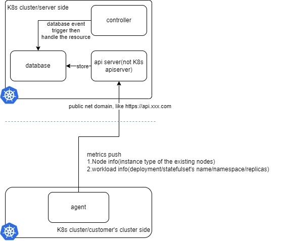
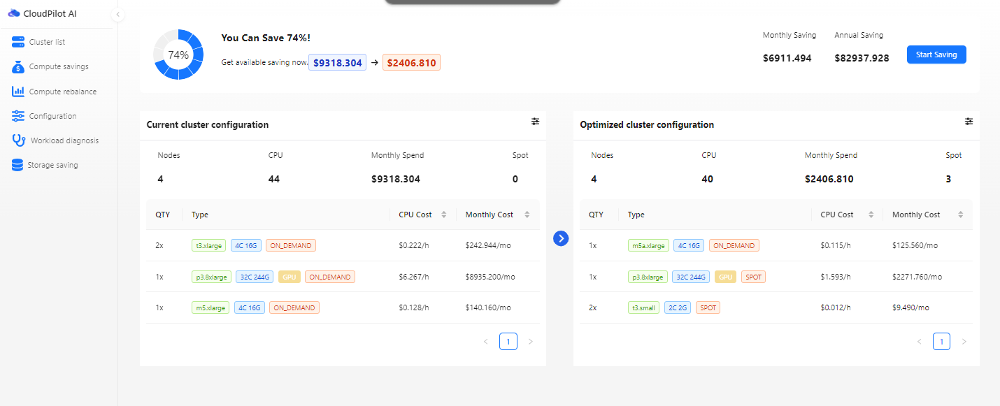

# System Architecture Design

Please write a rough design document for a system with high availability, security, and performance.

Evaluation aspects:
- Depth of thinking on comprehensive architecture.

## Background

Our rough system architecture is illustrated as follows:

Customers install an agent component in their clusters, which pushes metrics to the API endpoint (https://api.xxx.com). On the server side, our API server processes and stores these metrics in the database. Another controller analyzes each cluster and provides optimization recommendations to customers, depicted as follows:

I want you to outline a rough design document for the system that ensures high availability, security, and performance.

> Hint: This can be implemented using Kubernetes (K8s) technologies, such as HPA. But for different components, we need use different technologies.

## Output

- A rough design document (English)